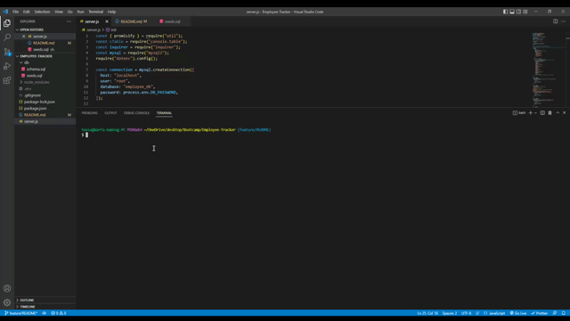

# Employee-Tracker

Built using Node.js, Inquirer, and MySQL.

## Table of Contents
* [Description](#description)
* [Installation](#installation)
* [Usage](#usage)
* [Tests](#test)
* [Licenses](#licenses)
* [Contact](#contact)
* [Credits](#credits)

## Description
This application is built with a command-line application from scratch to manage a company's employee database, using Node.js, Inquirer, and MySQL.

## Installation
You’ll need to use the MySQL2 package to connect to your MySQL database and perform queries, the Inquirer package to interact with the user via the command line, and the console.table package to print MySQL rows to the console. Also checkout using dotenv package to secure your MySQL password. 

## Usage

GIVEN a command-line application that accepts user input 
WHEN I start the application 
THEN I am presented with the following options: view all departments, view all roles, view all employees, add a department, add a role, add an employee, and update an employee role 
WHEN I choose to view all departments 
THEN I am presented with a formatted table showing department names and department ids 
WHEN I choose to view all roles 
THEN I am presented with the job title, role id, the department that role belongs to, and the salary for that role 
WHEN I choose to view all employees 
THEN I am presented with a formatted table showing employee data, including employee ids, first names, last names, job titles, departments, salaries, and managers that the employees report to 
WHEN I choose to add a department 
THEN I am prompted to enter the name of the department and that department is added to the database 
WHEN I choose to add a role 
THEN I am prompted to enter the name, salary, and department for the role and that role is added to the database 
WHEN I choose to add an employee 
THEN I am prompted to enter the employee’s first name, last name, role, and manager, and that employee is added to the database 
WHEN I choose to update an employee role 
THEN I am prompted to select an employee to update and their new role and this information is updated in the database 

## Walkthrough Video 
Below is a GIF that demonstrates the functionality of the employee tracker.

## Licenses
     To view the MIT license. Click the license button above.
## Contact
If you have any additional questions, here's how to reach me.

GitHub: https://github.com/WarfaHa  
Email: Warfa60@gmail.com

## Credits
This database application was created by Warfa Hassan.
